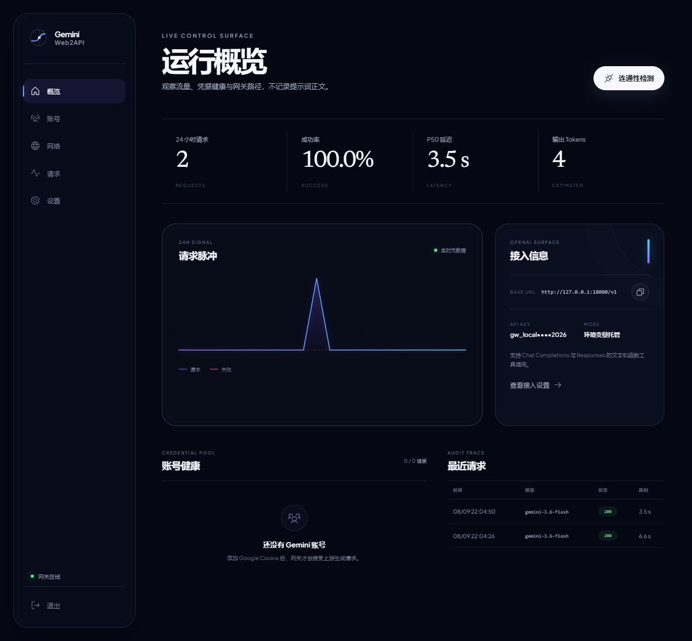
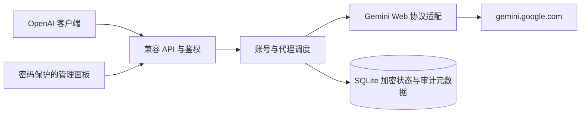

# Gemini Web2API

[](https://github.com/yayitinyu/gemini-web2api/actions/workflows/ci.yml)
[](https://github.com/yayitinyu/gemini-web2api/actions/workflows/container.yml)
[](LICENSE)

把 Gemini 网页端封装为 OpenAI 兼容 API 的自托管网关。后端是单个 Go 二进制，内置密码保护的 React 管理面板，面向 Linux VPS 与 Docker 部署。



> [!IMPORTANT]
> 这是非官方兼容项目，不隶属于 Google 或 OpenAI。Gemini Web 的内部协议可能随时变化；请遵守 Google 的服务条款，不要把重要生产系统只建立在网页内部接口上。

## 主要能力

- OpenAI 风格的 `GET /v1/models`、`POST /v1/chat/completions` 和 `POST /v1/responses`
- 非流式与 SSE 流式文本输出，以及 Chat Completions / Responses 函数工具格式
- 多 Gemini Web 账号轮询、账号健康检测、固定代理出口
- HTTP(S)、SOCKS5、SOCKS5H 代理池与连续失败熔断
- 密码保护的管理面板、登录限速、HttpOnly 会话 Cookie、CSRF 校验
- Google Cookie 与代理凭据使用 AES-GCM 加密；API Key 只保存 SHA-256 摘要
- SQLite 持久化；请求审计只保存模型、状态、延迟和估算 Token，**不保存提示词或回答正文**
- amd64 / arm64 多架构镜像，由 GitHub Actions 自动测试并发布到 GHCR

## 兼容范围

| 能力 | 状态 | 说明 |
| --- | --- | --- |
| Chat Completions | 支持 | 文本、多轮消息、流式响应、usage |
| Responses API | 支持 | 文本输入、规范 SSE 生命周期、函数工具项 |
| Function tools | 支持 | 通过受约束的提示协议适配，不是 Gemini Web 原生结构化工具通道 |
| Reasoning content | 尽力支持 | 上游提供时映射为 `reasoning_content` |
| 图片、音频输入 | 不支持 | 当前版本会返回明确的 `unsupported_input` 错误 |
| Images / Audio API | 不支持 | 没有提供 `/v1/images` 或 `/v1/audio` 端点 |
| Token 计数 | 估算 | 网页协议不返回 OpenAI tokenizer 统计 |

当前模型目录：

- `gemini-3.6-flash`
- `gemini-3.5-flash-lite`
- `gemini-3.1-pro`（必须配置已登录的 Google Cookie）

模型 ID 与 Gemini Web 后端令牌可能变化，可在管理面板中进行连通性检测。

## 快速部署

### 1. 准备配置

```bash
git clone https://github.com/yayitinyu/gemini-web2api.git
cd gemini-web2api
cp .env.example .env
```

至少修改 `.env` 中的管理密码：

```dotenv
ADMIN_PASSWORD=请替换为足够长的随机密码
```

可以用 `openssl rand -base64 32` 生成密码。`API_KEY` 留空时，首次启动会生成一枚密钥并且只在容器日志中显示一次；生产环境也可以预先填写至少 16 个字符的密钥。

### 2. 启动

```bash
docker compose up -d
docker compose ps
```

默认只监听 VPS 的 `127.0.0.1:8080`，适合放在 HTTPS 反向代理之后。打开：

```text
http://127.0.0.1:8080/admin/
```

如果 `API_KEY` 为空，读取首次生成的密钥：

```bash
docker compose logs gateway
```

看到 `generated initial API key` 后立即保存；数据库中只有摘要，之后无法恢复原文。也可以登录面板，在「设置 → 访问凭据」中轮换。

### 3. 配置 HTTPS

推荐让 Caddy、Nginx 或 Cloudflare Tunnel 终止 TLS，再转发到 `127.0.0.1:8080`。例如 Caddy：

```caddyfile
api.example.com {
    reverse_proxy 127.0.0.1:8080
}
```

同时在 `.env` 中设置：

```dotenv
COOKIE_SECURE=true
TRUST_PROXY_HEADERS=true
```

然后运行 `docker compose up -d` 重新创建容器。只有当前端代理完全可信时才启用 `TRUST_PROXY_HEADERS`。

若确定要直接公开端口，可以设置 `BIND_ADDRESS=0.0.0.0`，但不建议在没有 HTTPS 和防火墙限制的情况下暴露管理面板。

## 添加 Gemini Web 账号

1. 在你自己的浏览器中登录 `https://gemini.google.com`。
2. 从该站点的开发者工具或一次已认证请求中复制完整 `Cookie` 请求头。至少应包含有效的 `__Secure-1PSID` 与相关会话字段。
3. 打开管理面板「账号」，粘贴 Cookie 并保存。
4. 对该账号运行「检测」。健康状态变为绿色后再接入客户端。

Cookie 是 Google 账号的敏感凭据。不要发给他人，不要提交到 Git，不要放进未加密日志；建议使用专门账号并控制 VPS 访问权限。

## 调用 API

### Chat Completions

```bash
curl https://api.example.com/v1/chat/completions \
  -H "Authorization: Bearer $GEMINI_WEB2API_KEY" \
  -H "Content-Type: application/json" \
  -d '{
    "model": "gemini-3.6-flash",
    "messages": [{"role": "user", "content": "只回复 OK"}],
    "stream": false
  }'
```

### Responses API

```bash
curl https://api.example.com/v1/responses \
  -H "Authorization: Bearer $GEMINI_WEB2API_KEY" \
  -H "Content-Type: application/json" \
  -d '{
    "model": "gemini-3.6-flash",
    "input": "用一句话解释幂等性",
    "stream": true
  }'
```

### OpenAI SDK

```python
from openai import OpenAI

client = OpenAI(
    base_url="https://api.example.com/v1",
    api_key="your-gateway-api-key",
)

response = client.chat.completions.create(
    model="gemini-3.6-flash",
    messages=[{"role": "user", "content": "Hello"}],
)
print(response.choices[0].message.content)
```

## 运行策略



- 账号使用最少最近使用策略分配；失败后才切换其他账号。
- 代理连续失败会进入五分钟冷却，面板可手动重置。
- 重试只发生在尚未向客户端发送内容之前，避免重复流式输出。
- 容器重启会撤销已有管理会话；修改 `ADMIN_PASSWORD` 后不会遗留旧登录状态。
- 匿名回退和直连回退默认关闭，避免请求静默改变身份或出口边界。
- Gemini 页面令牌默认动态发现，也可以在设置中固定用于故障排查。

## 环境变量

| 变量 | 默认值 | 说明 |
| --- | --- | --- |
| `ADMIN_PASSWORD` | 无 | 必填，至少 12 个字符 |
| `API_KEY` | 自动生成 | OpenAI 兼容端点密钥，至少 16 个字符；设置后面板不可轮换 |
| `DATA_ENCRYPTION_KEY` | 自动持久化 | 可选，base64 编码的 32 字节密钥 |
| `LISTEN_ADDR` | `:8080` | 容器内监听地址 |
| `DATA_DIR` | `/data` | SQLite 和自动生成加密主密钥的目录 |
| `DATABASE_PATH` | `$DATA_DIR/gateway.db` | 可选的 SQLite 路径覆盖 |
| `COOKIE_SECURE` | `false` | HTTPS 部署应设为 `true` |
| `TRUST_PROXY_HEADERS` | `false` | 只在可信反向代理后启用 |
| `SESSION_TTL` | `24h` | 管理会话有效期，范围 5 分钟至 30 天 |
| `MAX_REQUEST_BODY_BYTES` | `16777216` | API 请求体上限，范围 1–64 MiB |
| `UPSTREAM_BASE_URL` | `https://gemini.google.com` | 仅供测试或协议调试覆盖 |

Compose 额外读取 `BIND_ADDRESS` 和 `PORT` 来控制宿主机端口映射。
布尔值、时长或整数格式错误时，进程会直接拒绝启动，不会静默采用较弱的默认设置。

## 数据、备份与更新

所有持久化状态位于 Docker volume `gemini-web2api_gateway-data`（实际前缀取决于 Compose 项目名）。其中包含 SQLite 数据库和可能自动生成的加密主密钥，两者必须一起备份。

做一致性冷备份时，先停止容器，再复制整个 volume；不要只复制 `gateway.db`。恢复前保留原 volume，确认新副本可以启动后再处理旧数据。

更新镜像：

```bash
docker compose pull
docker compose up -d
docker compose ps
```

## 本地开发

需要 Go 1.26+ 与 Node.js 24+：

```bash
cd web
npm ci
npm test
npm run build
cd ..

$env:ADMIN_PASSWORD = "a-development-password"
go run ./cmd/gateway
```

PowerShell 示例中的环境变量只对当前终端有效。前端开发服务器可在 `web` 目录运行 `npm run dev`，API 请求会代理到 `127.0.0.1:8080`。

完整校验：

```bash
go test ./...
cd web && npm test && npm run build
```

容器使用非 root、只读根文件系统、丢弃全部 Linux capabilities，并提供内置健康检查。GitHub Actions 在 `main` 和 `v*` 标签上构建 `linux/amd64` 与 `linux/arm64` 镜像。

## 致谢与许可

协议研究参考了 [zexadev/gemini-web2api-go](https://github.com/zexadev/gemini-web2api-go) 与 [Sophomoresty/gemini-web2api](https://github.com/Sophomoresty/gemini-web2api)。详见 [THIRD_PARTY_NOTICES.md](THIRD_PARTY_NOTICES.md)。

本项目使用 [MIT License](LICENSE)。
